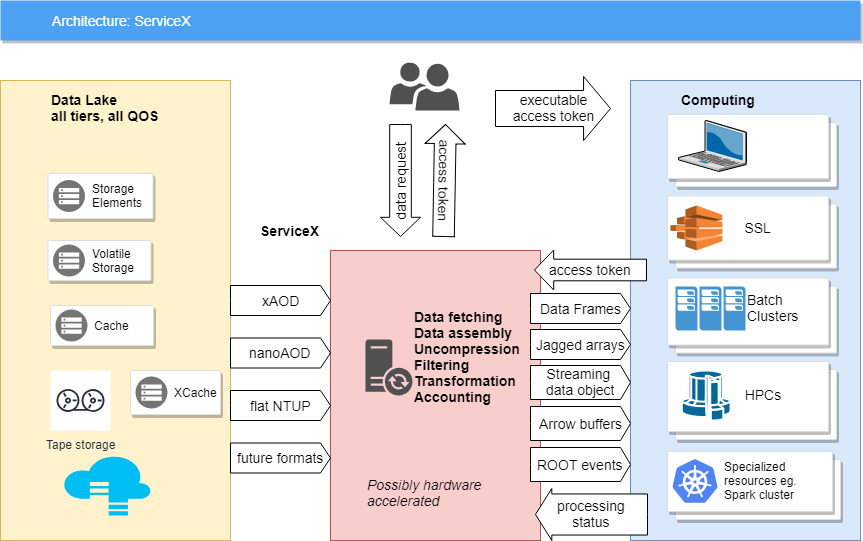

# ServiceX Documentation

[ServiceX](https://github.com/ssl-hep/ServiceX), a component of the
[IRIS-HEP](https://iris-hep.org/) Intelligent Data Delivery Service, is an experiment-agnostic
service to enable on-demand columnar data delivery tailored for nearly interactive, high
performance, array-based Pythonic analyses. It provides a uniform backend interface to data storage
services and an intuitive frontend for users to enable columnar transformations from multiple
different data formats and organizational structures.

For documentation on the ServiceX client software, please go to the [ServiceX Frontend](https://servicex-frontend.readthedocs.io) page. This site contains documentation concerning deployment of the ServiceX backend server and how to contribute code.

---

## Introduction

The High Luminosity Large Hadron Collider (HL-LHC) faces enormous computational challenges in the
2020s. The HL-LHC will produce exabytes of data each year, with increasingly complex event
structure due to high pileup conditions. The ATLAS and CMS experiments will record ~ 10 times as
much data from ~ 100 times as many collisions as were used to discover the Higgs boson.

### Columnar data delivery

ServiceX seeks to enable on-demand data delivery of columnar data in a variety of formats for
physics analyses. It provides a uniform backend to data storage services, ensuring the user doesn't
have to know how or where the data is stored, and is capable of on-the-fly data transformations
into a variety of formats (ROOT files, Arrow arrays, Parquet files, ...) The service offers
preprocessing functionality via an analysis description language called
[func-adl](https://pypi.org/project/func-adl/) that allows users to filter events, request columns,
and even compute new variables. This enables the user to start from any format and extract only the
data needed for an analysis.

ServiceX is designed to feed columns to a user running an analysis (e.g. via
[Awkward](https://github.com/scikit-hep/awkward-array) or
[Coffea](https://github.com/CoffeaTeam/coffea) tools) based on the results of a query designed by
the user.

---

## Table of Contents

### Deployment

- [Introduction to ServiceX Deployment](deployment/basic.md)
  - Prerequisites
  - Authenticating to the grid
  - Deploying ServiceX with Helm
  - Testing with port forwarding
- [ServiceX in Production](deployment/production.md)
  - External access and Ingress configuration
  - TLS configuration
  - Authentication with Globus Auth
  - Scaling and autoscaling
  - Data Lifecycle Service
- [Columnar Output Options](deployment/output_options.md)
  - Minio
  - POSIX mounted volumes
- [User Management](deployment/user_management.md)
  - Flask CLI
  - Loading default users from JSON
  - Self-service account creation
- [Helm Chart Reference](deployment/reference.md)

### Development

- [ServiceX Architecture](development/architecture.md)
  - Frontend and backend components
  - API server, DID Finder, Code Generator, Transformers
  - Error handling, logging, and monitoring
- [Running ServiceX Locally](development/running_locally.md)
  - Prerequisites and setup
  - Configuring and starting Overmind
  - Usage
- [Contributor Guide](development/contributing.md)
  - Branching strategy and development workflow
  - Running the full chart locally
  - Debugging tips
  - Notes for maintainers
