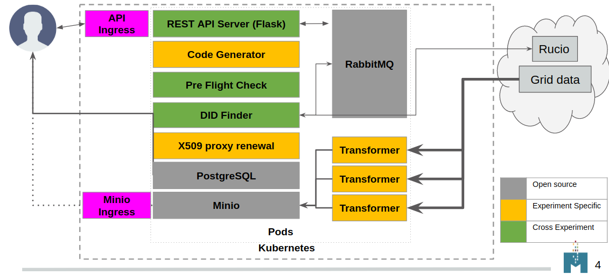

# ServiceX Architecture

## Frontend

ServiceX is accessed via clients distributed as Python packages. 
There is one client for each query language that may be used to access ServiceX. 
While it is possible to install clients individually, 
the [servicex-clients](https://pypi.org/project/servicex-clients/) umbrella package 
lists all of them as dependencies, so that they can all be installed 
with a single command: `pip install servicex-clients`.

The individual clients are as follows:
- [func-adl-servicex](https://pypi.org/project/func-adl-servicex/) for the func-ADL query language. Supports both xAOD and uproot files.
- [tcut-to-qastle](https://pypi.org/project/tcut-to-qastle/) translates TCut selection strings. Supports only uproot files.

Each client provides an API for specifying a query, which is ultimately represented as an abstract syntax tree in [Qastle](https://github.com/iris-hep/qastle).

[Need Gordon to expand here on package organization, func-ADL, Qastle]

Both clients then rely on the [ServiceX frontend](https://pypi.org/project/servicex/) package, which contains the code for communicating with a ServiceX backend. The workflow is as follows:
- Given a query, the ServiceX frontend constructs a JSON payload for the request. 
- It then hashes the request and checks a local cache which it maintains.
  - If the request is identical to one which the user has submitted previously, it asks the backend for the data associated with the older request. 
  - Otherwise, it submits a new transformation request to the backend.

## Backend

The ServiceX backend is distributed as a Helm chart for deployment to a Kubernetes cluster. The [chart](https://github.com/ssl-hep/ServiceX.git) a number of microservices, described in the sections below.
### ServiceX API Server (Flask app)
 This is the main entry point to ServiceX, and can be exposed outside the cluster via an external ingress. It provides a REST API for creating transformation requests, posting and retrieving status updates, and retrieving the results. It also servers a frontend web application where users can authenticate and obtain ServiceX API tokens. ([repository](https://github.com/ssl-hep/ServiceX_App.git))

### PostgreSQL
 A relational database which stores information about transformation requests, files, and users.

### DID Finder
 Service which looks up a datasets that should be processed, gets a list of paths and number of events for all the files in the dataset. This is done usig Rucio API.

### Code Generator
 A microservice which takes a query written in a specific query language (e.g. FuncADL) and generates C++ source code to perform this transformation on files of a given type (e.g. xAOD). As a result, each ServiceX deployment is specific to a (query language, file type) pair.

### X509 Proxy Renewal Service
 This service passes the provided grid cert and key to the VOMS proxy server to generate an X509 proxy which is stored as a Kubernetes Secret.

### RabbitMQ 
 Coordinates messages between microservices. A queue is created for each transformation request. One message is placed in the queue per file. Transformers consume messages while one is available and transform the corresponding file.
### Minio
 Minio stores file objects associated with a given transformation request. Can be exposed outside the cluster via a bundled ingress.

### Pre-Flight Check 
Attempts to transform a sample file using the same Docker image as the transformers. If this fails, no transformers will be launched.

### Transformers
Transformers are the worker pods for a transformation request. 
They compile the generated C++ code, and then subscribe to the RabbitMQ topic for the request.
They will listen for a message (file) from the queue, and then attempt to transform the file.
If any errors are encountered, they will post a status update and retry.
Once the max retry limit is reached, they will mark the file as failed.
If the file is transformed successfully, they will post an update and mark the file as done. 

## Error handling

## Monitoring and Accounting
A single transformer may transform several files. 
Once all files are complete for the transformation request, they are spun down.
