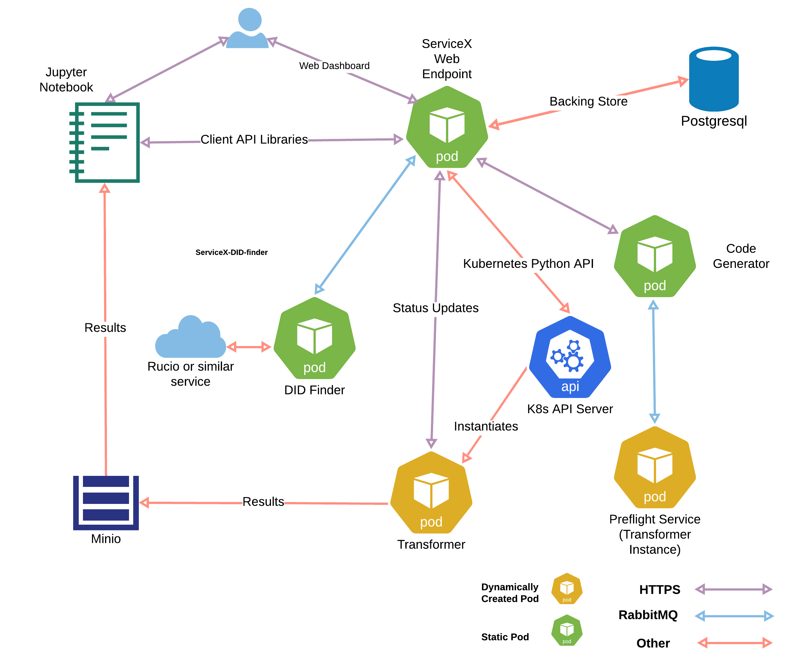
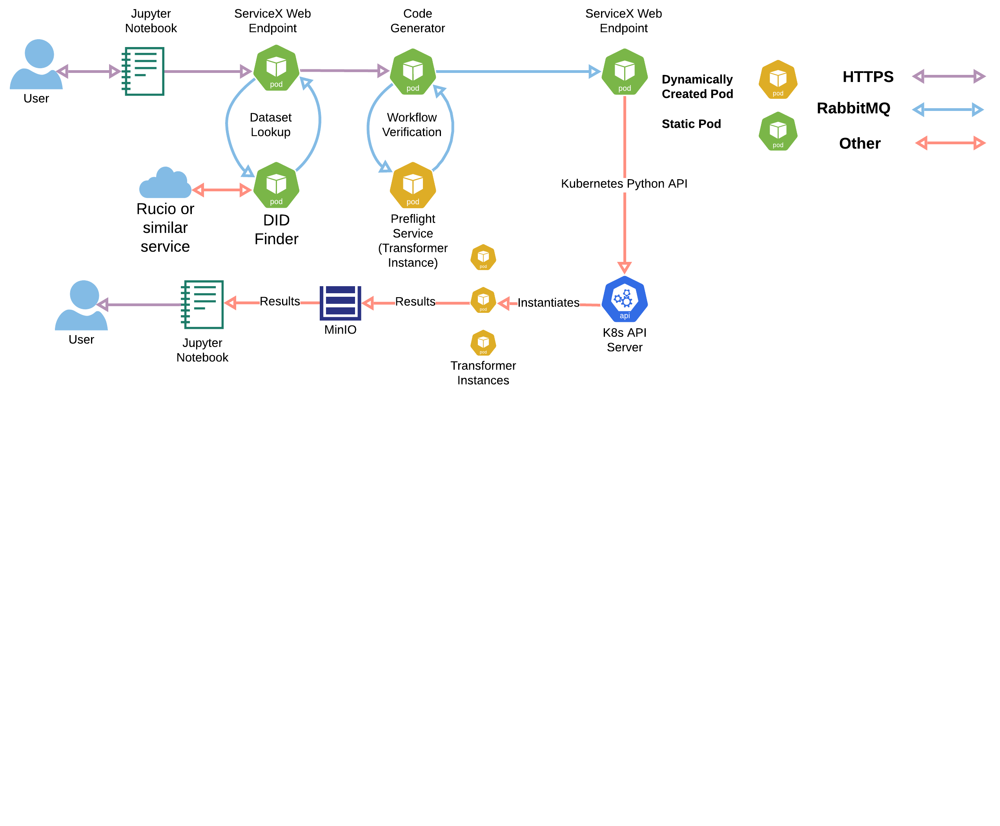
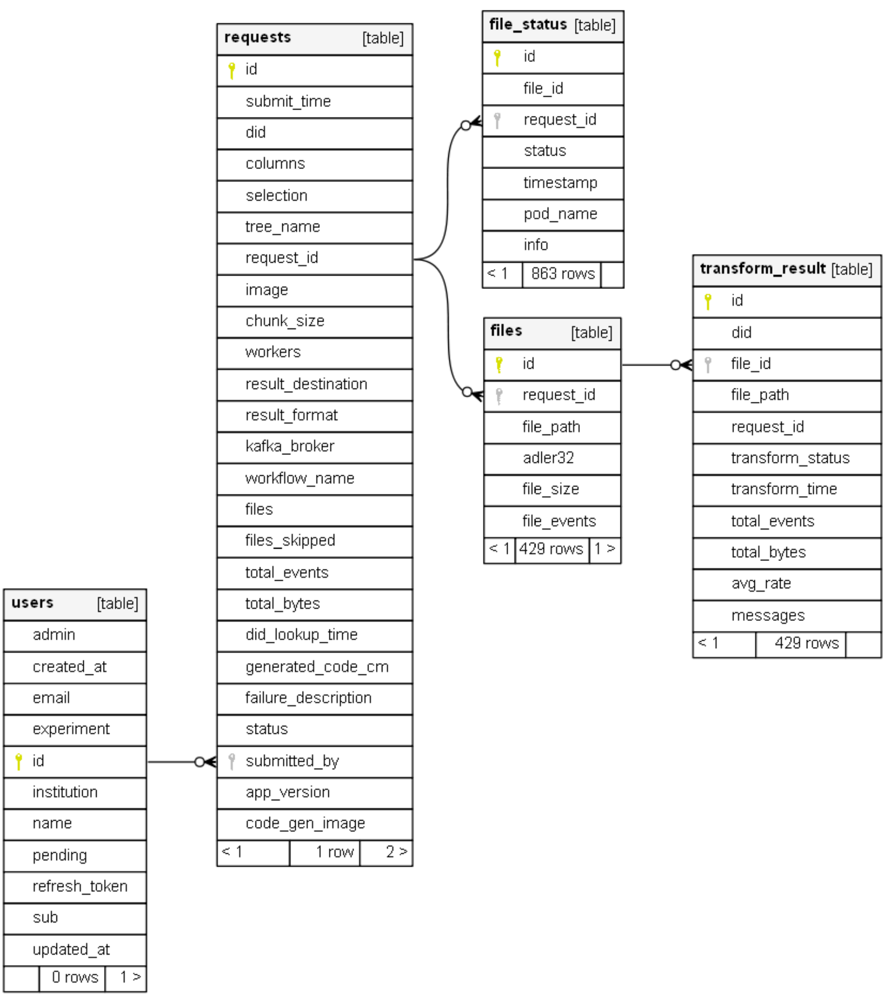

# ServiceX Architecture

## Frontend

 ServiceX presents a RESTful interface for submitting transformation requests and
 requesting status updates. Most users will not wish to interact directly with
 the REST interface so typically, ServiceX is accessed via clients distributed
 as Python packages. There is one client for each query language that may be
 used to access ServiceX. While it is possible to install clients individually,
 the [servicex-clients](https://pypi.org/project/servicex-clients/) umbrella
 package lists all of them as dependencies, so that they can all be installed
 with a single command: `pip install servicex-clients`.

 The individual clients are as follows:

- [func-adl-servicex](https://pypi.org/project/func-adl-servicex/) for the
   func-ADL query language Supports both xAOD and uproot files.
- [tcut-to-qastle](https://pypi.org/project/tcut-to-qastle/) translates TCut
   selection strings. Supports only uproot files.

 Each of the above clients provides an API for specifying a query, which is
 ultimately represented as an abstract syntax tree in
 [Qastle](https://github.com/iris-hep/qastle). The `qastle` is then handed off
 to the frontend package, which manages the interaction with ServiceX.

The [ServiceX frontend](https://pypi.org/project/servicex/) package contains the
code for communicating with a ServiceX backend. The workflow is as follows:

- Given a query, the ServiceX frontend constructs a JSON payload for the
   request. The JSON payload contains the `qastle`, the DID, and anything else
   necessary to run the query.
- It then hashes the request and checks a local cache which it maintains.
- If the request is in the local request cache, then the system tries to load
    the data from the local disk cache. If it can't be found on the local disk
    cache, it requests the data from the backend. If any of these steps fail,
    then it moves onto the below step.
- Otherwise, it submits a new transformation request to the backend.

Some technical details of the above process:

- Since the JSON payload completely specifies a request to run on the backend,
  hashing it becomes a cache lookup key
- The cache is maintained on a local disk (its location is configurable)
- The frontend can deliver the data several ways:
  - Wait until the complete transform request has occurred, or return the data
    bit-by-bit as each piece of work is finished by ServiceX
  - The data can be copied locally to a file by the frontend code, or a valid
    Minio URL can be returned instead (valid for about one day after the request),
    and, as a last option, as a single large `awkward` or `pandas` object. In
    the case of `awkward`, lazy arrays are used. In the case of `pandas` the data
    must be rectilinear, and fit in memory.
  - The data comes back as a ROOT file or `parquet` file, depending if you ask
    for the `xAOD` backend or the `uproot` backend. This is loaded into the
    transformers that operate on these two types of files, and does need to be
    fixed. If you ask for an `awkward` or `pandas.DataFrame` the format
    conversion is handled automatically.
- Errors that occur during the transformation on the backend are reported as
  python exceptions by the frontend code.

## Backend

 The ServiceX backend is distributed as a Helm chart for deployment to a
 Kubernetes cluster. The [chart](https://github.com/ssl-hep/ServiceX.git) a
 number of microservices, described in the sections below.



The lifecycle of a request is shown below:



The repositories that correspond to each component are given in the table
below:

| Service | Repository |
| --------|------------|
| DID Finder  | [ServiceX_DID_Finder_lib](https://github.com/ssl-hep/ServiceX_DID_Finder_lib) |
| |  [ServiceX_DID_Finder_Rucio](https://github.com/ssl-hep/ServiceX_DID_Finder_Rucio) |
| | [ServiceX_DID_Finder_CERNOpenData](https://github.com/ssl-hep/ServiceX_DID_Finder_CERNOpenData) |
| ServiceX Web Endpoint | [ServiceX App](https://github.com/ssl-hep/ServiceX_App) |
| Code Generators | [ServiceX_Code_Generator](https://github.com/ssl-hep/ServiceX_Code_Generator) |
| | [ServiceX_Code_Generator_Config_File](https://github.com/ssl-hep/ServiceX_Code_Generator_Config_File) |
| | [ServiceX_Code_Generator_FuncADL_uproot](https://github.com/ssl-hep/ServiceX_Code_Generator_FuncADL_uproot) |
| | [ServiceX_Code_Generator_FuncADL_xAOD](https://github.com/ssl-hep/ServiceX_Code_Generator_FuncADL_xAOD) |
| Transformers | [ServiceX_Transformer_Template](https://github.com/ssl-hep/ServiceX_Transformer_Template) |
| | [ServiceX_transformer](https://github.com/ssl-hep/ServiceX_transformer) |
| | [ServiceX_Uproot_Transformer](https://github.com/ssl-hep/ServiceX_Uproot_Transformer) |
| | [ServiceX_xAOD_CPP_transformer](https://github.com/ssl-hep/ServiceX_xAOD_CPP_transformer) |
| Client Libraries | [servicex_clients](https://github.com/ssl-hep/servicex_clients) |
| | [TCutToQastleWrapper](https://github.com/ssl-hep/TCutToQastleWrapper) |

### [ServiceX API Server](https://github.com/ssl-hep/ServiceX_App.git) (Flask app)

This is the main entry point to ServiceX, and can be exposed outside the
cluster.  It provides a REST API for creating transformation requests, posting
and retrieving status updates, and retrieving the results. It also has a set of
private in-cluster REST endpoints for orchestrating the microservices

It also serves a frontend web application where users can authenticate via
OpenID Connect and obtain ServiceX API tokens.  Authentication is optional, and may be
enabled on a per-deployment basis (see below for more details).

Potential roadmap features for the web frontend include a dashboard of current
or past requests, and an administrative dashboard for managing users and
monitoring resource consumption.

#### **Authentication and Authorization**

If the `auth` configuration option is set to True when ServiceX is deployed,
requests to the API server must include a JWT access token.

To authorize their requests, users must provide a ServiceX API Token (JWT
refresh token) in their `servicex.yaml` file. The frontend Python client will
use this to obtain access tokens.

Users can obtain a ServiceX API token by visiting the frontend web application.
Users must authenticate by signing in to the configured OpenID Connect provider.
ServiceX can be set up to auto-accept new accounts, or to mark them as pending
approval by the
deployment's administrators.  This can be done via Slack if the webhook is
configured.  Once approved, new users will receive a welcome email via Mailgun
(if configured).

Future versions of ServiceX may support disabling OIDC auth and the internal
user management system, but retaining the JWT system.  ServiceX API Tokens would
need to be generated externally using the same secret used for the deployment.

<!-- #### **Endpoints** -->
<!--
 <B> Q:
   * REST API
     * Where is OpenAPI description/documentation?
   * WEB frontend:
     * "... and retrieving the results" Really? I don't think data goes through it but directly from minio to user. This is a very important point.
 </B> -->

### X509 Proxy Renewal Service

This service uses the provided grid certificate and key to authenticate against
a VOMS proxy server. This generates an X509 proxy which is stored as a
Kubernetes Secret. Proxy is renewed once per hour.

### Database

The ServiceX API server stores information about requests, files, and users (if
authentication is enabled) in a relational database. The default database is
PostgreSQL, without persistance. Another option is SQLite.  The API server uses
SQLAlchemy as an ORM (with Alembic and Flask-Migrate for schema changes).  No
other microservices communicate with the database.

The database schema used to store information is shown below:


### DID Finder

Service which looks up a datasets that should be processed, gets a list of paths
and number of events for all the files in the dataset.  This is done usig the
Rucio API. The DID finder uses an x509 proxy to authenticate to Rucio.

Since there may be multiple replicas of each file, the DID finder can let Rucio know the
location of the servicex instance (latitude and longitude) so that Rucio can deliver replicas
sorted according to their closeness.

The DID finder receives datasets to resolve via a RabbitMQ queue.
Resolved file replics are reported to the app via
POSTs to the `/files` endpoint. After the final file has posted in this way, a
PUT is sent to the `/complete` endpoint to let the service know all file
replicas have been reported. This message contains summary information about the
dataset. An example of a JSON message follows:

```json
{
    "files": self.summary.files,
    "total-events": self.summary.total_events,
    "total-bytes": self.summary.total_bytes,
    "elapsed-time": int(elapsed_time.total_seconds())
}
```

### Code Generator

Code generators are Flask web servers which take a
[`qastle`](https://github.com/iris-hep/qastle) query string as input and
generate a zip archive containing C++ source code which transforms files of a
given type (e.g. xAOD).

Currently, each deployment must specify a single code generator. As a result, a
ServiceX deployment is specific to a (query language, file type) pair. The code
generators run in separate containers because they have Python versioning
requirements that may be different from other components of ServiceX.
Eventually, we would like to support multiple code generators per deployment.

Code generation is supported for the following (query language, file type) pairs:

- [funcADL/xAOD](https://github.com/ssl-hep/ServiceX_Code_Generator_FuncADL_xAOD)
- [funcADL/uproot](https://github.com/ssl-hep/ServiceX_Code_Generator_FuncADL_uproot)

The generated code is placed into a Kubernetes ConfigMap named after the
transformation uuid. This configmap is mounted into the transformer pods
when they are launched.

There is a simple [kubernetes yaml
file](https://github.com/ssl-hep/ServiceX/blob/develop/scripts/generated_code_busybox.yaml)
for deploying a busybox pod which mounts one of the generated code configmaps.

### RabbitMQ

RabbitMQ coordinates messages between the microservices and the API Server. There
is a queue sitting in front of the DID finder, receiving lookup requests. The
transformer workers are fed from a topic specific to a transform request. Files
that fail transformation are placed onto a dead letter queue to allow
transactionally secure reprocessing

### Minio

 Minio stores file objects associated with a given transformation request.
 It can be exposed outside the cluster via a bundled ingress. At present there is
 no cleanup of these generated files, so they must be deleted manually.
 Furthermore, there is no use of Minio user identities, so all files are saved
 in the same namespace with no quota enforcement.

### Pre-Flight Check

 Attempts to transform a sample file using the same Docker image as the
 transformers. If this fails, no transformers will be launched. This validates
 the generated code as well as the apporpriateness of the request relative to the
 properties in the sample file.

### Transformers

Transformers are the worker pods for a transformation request. They operate as
two containers inside each worker pod. The sidecar container communicates with the server
as well as Minio to upload results. The science container is based on experiement
approved docker images and have no ServiceX specific dependencies.

The sidecar operates as a Celery worker which handles the `transform_file` task. Each
invocation of the task is a single file transformation, which includes a list of XrootD
replica paths, the transformation request ID, and the file index. The sidecar container
communicates with the science image via a localhost socket and a directory mounted in both
containers.

The generated code is mounted into the science container from a configmap.

The science container writes a log file to this shared directory. The sidecar uses information
provided by the code generator to parse the file to report transform statistics to
the API server along with common error messages.

The Celery worker is started with the `--concurrency` flag set to 1. This is to ensure
that only one file is transformed at a time. This is necessary because the science container
is not thread safe.

The Celery worker is also initialized with a queue named after the transformation request ID.
The ServiceX App uses dynamic routing to send the task requests only to transformers belonging
to the same transformation request.

The sidecar initializes the queue with RabbitMQ options that specify the queue is not
durable and that it should be deleted when the last consumer disconnects. This is to ensure
that the queue is cleaned up when the transformation request is completed.

In addition to the Celery worker, the sidecar starts up a file upload process (it has to
be a process and not a thread in order to work alongside Celery). This process uses a queue
to receive requests to upload transformed results to minio. The request includes data needed
to notify the client that the file has been completed.

When the final file is transformed, the App will terminate the pods which will cause the
Celery worker to terminate cleanly. The sidecar will send a poison pill to the upload queue
to shut it down as well.


## Error handling

There are several distinct kinds of errors:

- User request is not correct
- Data is inaccessible
- Internal ServiceX issue
- Timeouts

## Logging

Every component writes log messages to stdout, viewable with `kubectl logs`. On top of that
there are two optional shipping paths, both configured under `logging` in the helm chart.

### Logstash / Elasticsearch

When `logging.logstash.enabled` is set, components attach a TCP logstash handler and send
structured records to an Elasticsearch cluster for presentation in Kibana dashboards. The
keys allowed in a record's `extra` dict are defined by `logging_schema.json` at the repo
root and enforced at commit time by `hooks/check_log_extras.py`.

### Vector / Postgres

When `logging.vector.enabled` is set, a **Vector aggregator** deployment
(`{release}-vector-aggregator`) writes log records into the Postgres `log_messages` table,
which the transformation request page renders as a filterable grid. It is the only thing
in the release that connects to Postgres for logging, and the only thing that holds the
database credentials. Everything else feeds it through its ClusterIP Service:

- **the app**, whose logger formats records as JSON matching the table's columns and writes
  them to the aggregator's TCP socket source, via a `QueueListener` background thread so
  logging never blocks the request path. The app has no Vector container of its own.
- **transformer worker pods**, when `logging.vector.transformer.enabled` is set.

A transformer pod still needs a local Vector, because one of its two log streams is a file
rather than a socket. `transformer_manager.py` gives each pod a `vector` container with:

- **the python transformer sidecar**, over a localhost socket, exactly as the app talks to
  the aggregator (`component = "transformer_sidecar"`);
- **the science container's stdout**, which `watch.sh` tees into `science.*.log` chunks on
  the shared output volume for Vector to tail (`component = "science"`). Vector deletes each
  chunk once it has read it, which is what keeps that volume from growing for the life of
  the pod.

That container's only sink is the aggregator, over Vector's native protocol. It never talks
to Postgres, which is what keeps database credentials out of pods that also run
user-supplied science images. The aggregator mints each row's UUID primary key.

Rows from all three components carry the `request_id`, which is what the request page
filters on, so transformer logs outlive the pods that produced them.

Two caveats worth knowing. Science log lines are unstructured, so their severity is a
keyword guess and their timestamp is Vector's ingest time rather than the science program's.
And `watch.sh`'s own `echo` output is not tee'd — only the transform command's output is —
so those lines stay in `kubectl logs` only; the sidecar separately logs hard failures with
the captured output in `extra.log_body`.

The Postgres connection count is now fixed at `aggregator.replicas x aggregator.poolSize`
rather than growing with `maxReplicas x concurrent transforms`. Because the aggregator is a
choke point, its Postgres sink is backed by a disk buffer (on the pod's `emptyDir`) by
default, so a Postgres outage or a sink restart does not immediately drop records; set
`logging.vector.aggregator.buffer.type=memory` to trade that durability for disk. The
deployment's health probes use Vector's own API, so a replica replaying its buffer is kept
out of the Service.

## Monitoring and Accounting

There is a limited support for Elasticsearch based accounting. It requires
direct connection to ES and account. Only sends and updates requests and file
paths.
