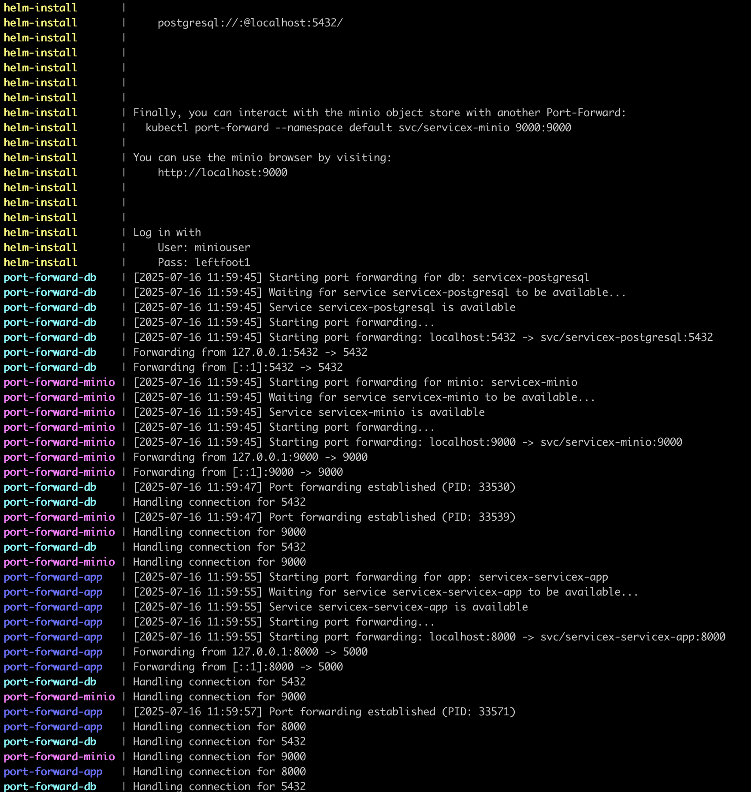

# Running ServiceX Locally

This guide explains how to run ServiceX locally for development purposes using Overmind.

Once complete:

1. Changes to your local ServiceX checkout will be immediately reflected in your running app pods.
2. The minikube mount process and separate port forward processes are collected into a single Procfile and executed via Overmind.

To enable local changes, make sure the values file you are using contains this definition. (Note if the environment attribute is not set specifically to "dev", `mountLocal` and `reload` will not be available.)
```bash
app:
  environment: dev
  mountLocal: true
  reload: true
```

## Prerequisites
- Minikube or similar Kubernetes cluster
- Helm

## Setup Instructions

### 1. Setup CERN Grid Certificate

1. Go to your CERN grid account: https://ca.cern.ch/ca/
2. Click **New Grid User certificate** and walk through the flow to create a cert
3. Download your cert as a .p12 file. You will need to create a PEM key and cert from this and place them in your .globus file in your home directory:
   ```bash
   openssl pkcs12 -nocerts -in ./myCertificate.p12 -out ~/.globus/userkey.pem
   openssl pkcs12 -clcerts -nokeys -in ./myCertificate.p12 -out ~/.globus/usercert.pem
   ```
4. Install the CLI to a Python environment. Note you will need to force upgrade the OpenSSL library as shown below:
   ```bash
   pip install servicex-cli
   pip install PyOpenSSL==25.0.0
   servicex --namespace default init --cert-dir ~/.globus
   ```

### 2. Download SSL Helm Charts

1. Go to https://github.com/ssl-hep/ssl-helm-charts/tree/gh-pages
2. Find the most recent version
3. Download and unzip the .tgz file locally. Example:
   ```bash
   tar -xzf servicex-1.7.1-rc.1.tgz
   ```

### 3. Add Helm Values File

Create a file in the servicex helm chart directory called `local-values.yaml`:

```yaml
app:
  environment: dev
  mountLocal: true
  reload: true

postgres:
  enabled: true

objectStore:
  publicURL: localhost:9000
  publicClientUseTLS: false
  useTLS: false

gridAccount: (cern user id)

x509Secrets:
  vomsOrg: atlas
```

### 4. Add Helm Chart Repository

Add the SSL HEP helm chart repository:

```bash
helm repo add ssl-hep https://ssl-hep.github.io/ssl-helm-charts/
helm repo update
```

### 5. Install Overmind

Install Overmind following the documentation at: https://github.com/DarthSim/overmind

**Installation requirements:**
- Install tmux (if not already installed):
  - macOS: `brew install tmux`
  - Ubuntu: `sudo apt install tmux`
- Install ruby: `brew install ruby` (macOS) or `sudo apt install ruby` (Ubuntu) or your OS equivalent
- Install Overmind: `gem install overmind`

**Note:** When installing Overmind via gem, you may need to use the `--user-install` argument. If you enable this option, Overmind will be installed in your home directory. You will need to locate it and make sure it is available in your PATH.

### 6. Set Environment Variables

Navigate to your ServiceX checkout (where the `Procfile` is located) and set the required environment variables:

- `LOCAL_DIR`: Path to your ServiceX directory
- `CHART_DIR`: Path to your helm chart directory
- `VALUES_FILE`: Path to your helm values file (can be absolute or relative to `$CHART_DIR`)

Example command:
```bash
LOCAL_DIR=/Users/mattshirley/work/ServiceX VALUES_FILE=local-values.yaml CHART_DIR=/Users/mattshirley/Documents/servicex overmind start
```

### 7. Create Convenience Aliases (Optional)

Adding aliases for these start up commands makes it very simple to start and stop the `servicex` helm installation.

To do this, adapt the following commands to your local directory structure. Add `alias` definitions for each command to your `~/.bashrc` file:

```bash
alias servicex-up='minikube start && cd /Users/mattshirley/work/ServiceX && LOCAL_DIR=/Users/mattshirley/work/ServiceX VALUES_FILE=local-values.yaml CHART_DIR=/Users/mattshirley/Documents/servicex overmind start'
alias servicex-down='helm delete servicex'
alias servicex-start='servicex-up; servicex-down;'
alias servicex-upgrade='cd /Users/mattshirley/Documents/servicex && helm upgrade -f /Users/mattshirley/Documents/servicex/local-values.yaml servicex .'
```

After adding the aliases, refresh your `.bashrc` file:
```bash
source ~/.bashrc
```

## Usage

- Start ServiceX: `servicex-start`
- Upgrade ServiceX: `servicex-upgrade`
- Stop ServiceX: Kill the overmind process (this will also uninstall the helm deployment)
- Note: Minikube will continue running after stopping ServiceX

Overmind will start up its processes, spit some noise onto the screen (including the servicex helm installation message) for twenty or thirty seconds. Eventually it will quiet down and only output port forwarding connections.

