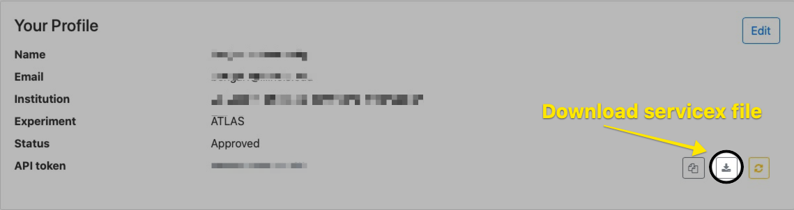

# ServiceX in 5 minutes

ServiceX is a data delivery service for high energy physicists working on the ATLAS and CMS collaborations on the LHC. It retrieves data from the grid, applies any desired transformations (such as filters or computations), and returns it in a columnar format.
Requests to ServiceX can be made in Python using the [func-ADL](https://pypi.org/project/func-adl-servicex/1.0/) analysis description language or TCut selection strings.

## Prerequisites

- Python 3.6, 3.7, or 3.8
- Member of the ATLAS or CMS collaborations

## Installation

```bash
pip install servicex-clients
```

This is an umbrella package which includes all of the frontend client
libraries used to communicate with a ServiceX backend.
There are multiple ways to specify a request, but we will use
func-ADL in this tutorial.

## Selecting an endpoint

To use the ServiceX client, you will need a ServiceX API token issued by a
ServiceX backend instance. Each ServiceX instance is dedicated to a specific
experiment and file format.
You can use one of the centrally-managed instances of ServiceX running on the
University of Chicago's Analysis Facility cluster:

| Endpoint                                   | Collaboration | Type   | Input        |
|-----------------------------               |------         |-----   |-------       |
| <https://xaod.servicex.af.uchicago.edu/>        | ATLAS         | xaod   | xAOD files   |
| <https://uproot-atlas.servicex.af.uchicago.edu/>  | ATLAS         | uproot | Flat ntuples |

You can view the status of these production servers along with our current
development servers by viewing the [Server Status Dashboard](https://dashboard-integration.servicex.ssl-hep.org).

Visit the instance that meets your needs. Click on the _Sign-in_ button in the
upper right hand corner. You will be asked to authenticate via GlobusAuth and
complete a registration form. Once this form is submitted, it will be reviewed
by SSL staff. You will receive an email upon approval.

At this time you may return to the ServiceX page. Click on your name in the
upper right hand corner and then select _Profile_ tab. Click on the download
button to have a servicex.yaml file generated with your access token and
downloaded to your computer.



You may place this in your home directory or within
the [servicex_frontend search path](https://github.com/ssl-hep/ServiceX_frontend#configuration).

The remainder of this guide will use the xAOD instance.

## First request

Once you've been approved, you're ready to go!

You can interact with ServiceX by making a transformation request. A transformation request includes the following information:

- An input dataset
- Filters to be applied
- Computation of new columns (if any)
- Columns to be returned to the user

Below are some basic examples which you can run to confirm that ServiceX is working for you.

### xAOD

```python
from func_adl_servicex import ServiceXSourceXAOD

dataset_name = "mc15_13TeV:mc15_13TeV.361106.PowhegPythia8EvtGen_AZNLOCTEQ6L1_Zee.merge.DAOD_STDM3.e3601_s2576_s2132_r6630_r6264_p2363_tid05630052_00"
src = ServiceXSourceXAOD(dataset_name)
df = src \
    .SelectMany('lambda e: e.Jets("AntiKt4EMTopoJets")') \
    .Select('lambda j: j.pt()/1000.0') \
    .AsPandasDF('JetPt') \
    .value()
print(df)
```

Expected output:

```
            JetPt
entry            
0       36.319766
1       34.331914
2       16.590844
3       11.389335
4        9.441805
...           ...
857133   6.211655
857134  47.653145
857135  32.738951
857136   6.260789
857137   5.394783

[11355980 rows x 1 columns]
```

### uproot

Instead of a rucio dataset, here we will use a file directly available over `https`,
and a slightly more complex query, and we'll ask for the data to be locally downloaded
so we can access the files directly.

```python
from func_adl_servicex import ServiceXSourceUpROOT
import servicex
import awkward as ak

dataset_name = [
    "https://xrootd-local.unl.edu:1094//store/user/AGC/nanoAOD/nanoaod15.root"
]
sx_dataset = servicex.ServiceXDataset(dataset_name, "uproot")
ds = ServiceXSourceUpROOT(sx_dataset, "Events")

data = ds.Select(
    lambda evt: {
        "pt": evt.GenJet_pt,
        "eta": evt.GenJet_eta,
        "phi": evt.GenJet_phi,
        "mass": evt.GenJet_mass,
    }
).AsParquetFiles('junk.parquet').value()

d = ak.from_parquet(data[0])
print(d)
print(len(d))
```

Expected output:

```python
[{pt: [36.3, 24.7], eta: [2.87, 3.13], phi: [, ... -2.15], mass: [12.3, 6.51, 3.98]}]
349
```

## Next steps

Check out the [requests guide](requests.md) to learn more about specifying transformation requests using func-ADL.
