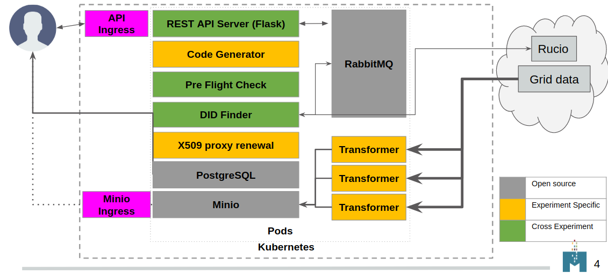
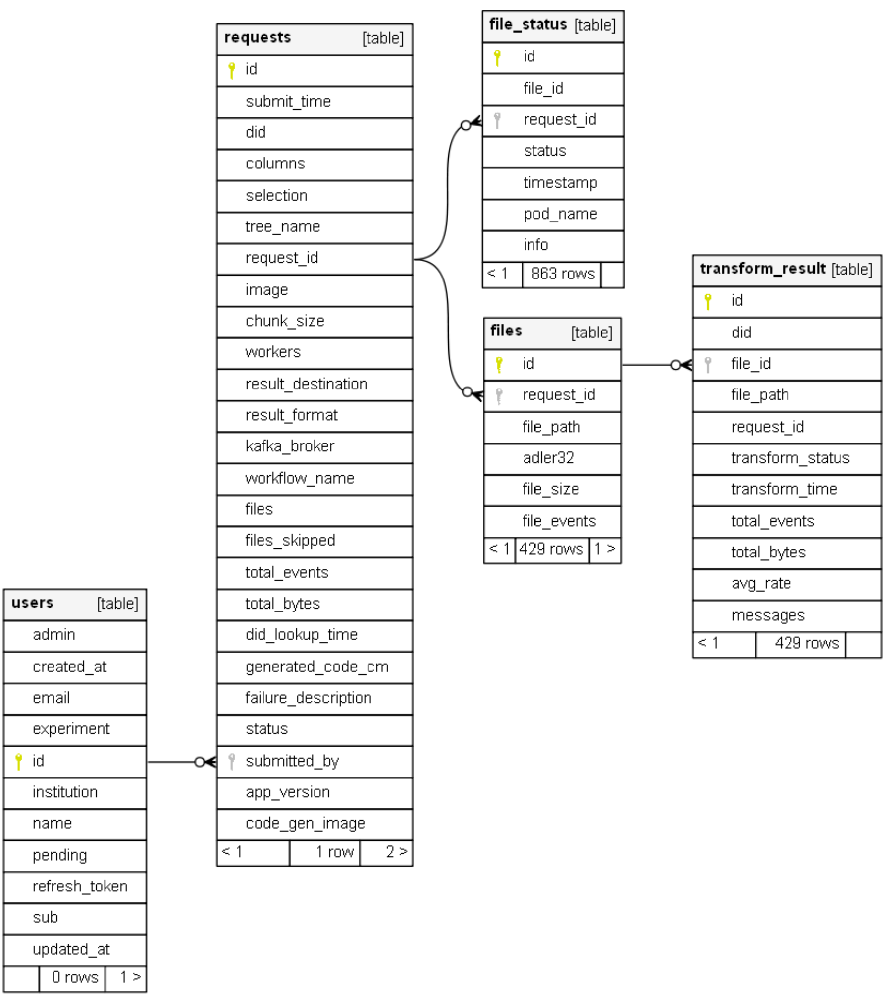

# ServiceX Architecture

## Frontend

 ServiceX is accessed via clients distributed as Python packages. There is one client for each query language that may be used to access ServiceX. While it is possible to install clients individually, the [servicex-clients](https://pypi.org/project/servicex-clients/) umbrella package lists all of them as dependencies, so that they can all be installed with a single command: `pip install servicex-clients`.

 The individual clients are as follows:
 - [func-adl-servicex](https://pypi.org/project/func-adl-servicex/) for the func-ADL query language Supports both xAOD and uproot files.
 - [tcut-to-qastle](https://pypi.org/project/tcut-to-qastle/) translates TCut selection strings. Supports only uproot files.

 Each client provides an API for specifying a query, which is ultimately represented as an abstract syntax tree in [Qastle](https://github.com/iris-hep/qastle).

[Need Gordon to expand here on package organization, func-ADL, Qastle]

 Both clients then rely on the [ServiceX frontend](https://pypi.org/project/servicex/) package, which contains the code for communicating with a ServiceX backend. The workflow is as follows:
 - Given a query, the ServiceX frontend constructs a JSON payload for the request. 
 - It then hashes the request and checks a local cache which it maintains.
   - If the request is identical to one which the user has submitted previously, it asks the backend for the data associated with the older request. 
   - Otherwise, it submits a new transformation request to the backend.

<B>Q:
  * Can we say here how the data gets delivered? Technology, format, etc.?
  * Are errors reported somewhere?
  * What is the cache? Minio? How does it checks if data is still there?
  * TODO:
    * Fix schema - transformers also talk to RMQ 
    * Fix schema - what talks to postgresql? </B>

## Backend

 The ServiceX backend is distributed as a Helm chart for deployment to a Kubernetes cluster. The [chart](https://github.com/ssl-hep/ServiceX.git) a number of microservices, described in the sections below.

### [ServiceX API Server](https://github.com/ssl-hep/ServiceX_App.git) (Flask app)
 This is the main entry point to ServiceX, and can be exposed outside the cluster. It provides a REST API for creating transformation requests, posting and retrieving status updates, and retrieving the results. 
 
 It also serves a frontend web application where users can authenticate via Globus and obtain ServiceX API tokens. 
 Authentication is optional, and may be enabled on a per-deployment basis.
 Potential roadmap features for the web frontend include a dashboard of current / past requests, 
 and an administrative dashboard for managing users and monitoring resource consumption.
 
 <B> Q:
   * REST API
     * Where is OpenAPI description/documentation?   
   * WEB frontend:
     * "... and retrieving the results" Really? I don't think data goes through it but directly from minio to user. This is a very important point.
 </B>

### X509 Proxy Renewal Service
 This service uses the provided grid certificate and key to authenticate against a VOMS proxy server. This generates an X509 proxy which is stored as a Kubernetes Secret. Proxy is renewed once per hour. 
 
 <B> TODO: 
 * should be changed to once per 10 or 23h</B>

### Database
The ServiceX API server stores information about requests, files, and users (if authentication is enabled) in a relational database. The default database is PostgreSQL, without persistance. Another option is SQLite. 
The API server uses SQLAlchemy as an ORM (with Alembic and Flask-Migrate for schema changes).
No other microservices communicate with the database.

 <B>We need more details here:
 * is data removed once request has been processed?
 * Why is this done? 
 * How will data be used/presented?
 * Could we know eg. slim and skim factors for each request?</B>

### DID Finder
Service which looks up a datasets that should be processed, gets a list of paths and number of events for all the files in the dataset. 
This is done usig the Rucio API. The DID finder uses an x509 proxy to authenticate to Rucio. 

<B>Q:
  * How does it handle multiple replicas of the same files?
  * Are there retries?
  * Does it sum up data size?</B>

### Code Generator
Code generators are microservices which take Qastle as input and generate C++ source code which transforms files of a given type (e.g. xAOD).
Each deployment must specify a single code generator. 
As a result, each ServiceX deployment is specific to a (query language, file type) pair.

Code generation is supported for the following (query language, file type) pairs:
- [funcADL/xAOD](https://github.com/ssl-hep/ServiceX_Code_Generator_FuncADL_xAOD)
- [funcADL/uproot](https://github.com/ssl-hep/ServiceX_Code_Generator_FuncADL_uproot)
- **Is there one for TCut?**

 <B>Q:
 * isn't this first translated to Qastle before generating C++ code?
 * links to the language?
 * what happens to the generated code? Stored somewhere? Can it be looked up?
 * Can the code generators be consolidated in any way, 
 so that they depend only on the file type, or nothing at all?
 * Since this is just another Flask server, can it be merged with the ServiceX API server?
 </B>

### RabbitMQ 
 Coordinates messages between microservices. A queue is created for each transformation request. One message is placed in the queue per file. Transformers consume messages while one is available and transform the corresponding file.
 
 <B>Q:
   * any other queues?
   * any other functionality except DID-finder adding messages and transformers consuming them?
   * Any message lifetime?
   * Are messages peristified in case of restart?</B>

### Minio
 Minio stores file objects associated with a given transformation request. Can be exposed outside the cluster via a bundled ingress.

 <B>Q:
   * any cleanup? manual or automatic? if automatic, what is the cleanup policy?
   * do we have at least a way to find out who/what uses space in Minio? 
   * can we see how much space is left? 
   * persistent between servicex/k8s restart?
   * do we know throughput we are generating on it?
   * do we know how often data gets written and not read out?
   * do we know how many times are data re-read?</B>

### Kafka
 Kafka used to be an option for output.

 <B>TODO:
  * if abandoned, it should be removed everywhere. Currently search for "kafka" returns 257 results in 34 files.
 </B>

### Pre-Flight Check 
 Attempts to transform a sample file using the same Docker image as the transformers. If this fails, no transformers will be launched.
 
 <B>TODO:
   * enable autoscaler. Since autoscaling will be default, it will newer start a lot of transformers right away but only one. This one will effectively serve as a check.
   * Figure out what needs to be done to get this do compilation so it is not performed at each transformer. Rename accordingly.

  Q:
   * is it optional? If not, can it be made optional? 
 </B>

### Transformers
 Transformers are the worker pods for a transformation request. They compile the generated C++ code, and then subscribe to the RabbitMQ topic for the request. They will listen for a message (file) from the queue, and then attempt to transform the file. If any errors are encountered, they will post a status update and retry. Once the max retry limit is reached, they will mark the file as failed. If the file is transformed successfully, they will post an update and mark the file as done. A single transformer may transform several files. Once all files are complete for the transformation request, they are spun down.

<B>Q:
 * Where do they get C++ code from?
 * Can one transformer do multiple different requests?
 * How do they get data? Is it always root:// protocol?
 * What will be fairshare policy?
 * Are they restarting for each file?
 * Is there something stoping them when required number of events has been processed?</B>
</B>

## User authentication and authorization
 
 <B>Q:
 * Needs description
 * What is user approval, removal interface? 
 * Mailing - still MailGun? What account? One for every deployment or?
 </B>

## Error handling

There are several distinct kinds of errors:
* user request is not correct
* data is inaccessible
* servicex internal issue
* timeouts

<B>TODO:
 * describe all the failure modes and how are they handled. 
</B>

## Logging

<B>Q:
 * Only kubectl log ... for the servicex itself?
 * No logs for user? How user finds out that eg. one of the files is being fetched from Canada and will take forewer? Or that the file is corrupted?
</B>

## Monitoring and Accounting
 There is a limited support for Elasticsearch based accounting. It requires direct connection to ES and account. Only sends and updates requests and file paths.
 
<B>TODO:
 * describe current Monitoring and Accounting
 * if elasticsearch will be used, it should be fronted with a central logstash and enabled by default for all servicex instances. Much more data should be reported to it. If not, it should be removed.
</B> 

