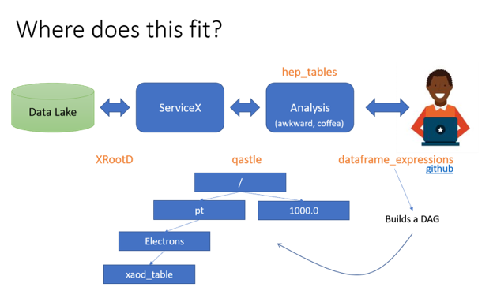

# Introduction

The High Luminosity Large Hadron Collider (HL-LHC) faces enormous computational challenges in the
2020s. The HL-LHC will produce exabytes of data each year, with increasingly complex event
structure due to high pileup conditions. The ATLAS and CMS experiments will record ~ 10 times as
much data from ~ 100 times as many collisions as were used to discover the Higgs boson.

## Columnar data delivery

ServiceX seeks to enable on-demand data delivery of columnar data in a variety of formats for
physics analyses. It provides a uniform backend to data storage services, ensuring the user doesn't
have to know how or where the data is stored, and is capable of on-the-fly data transformations
into a variety of formats (ROOT files, Arrow arrays, Parquet files, ...) The service offers
preprocessing functionality via an analysis description language called
[func-adl](https://pypi.org/project/func-adl/) that allows users to filter events in place, unpack
compressed formats, request columns, and specify computations to be applied to the results. This
enables the user to start from any format and extract only the data needed for an analysis.

As shown in the diagram, ServiceX is designed to feed columns to a user running an analysis (e.g.
via ``awkward`` or ``coffea`` tools) based on the results of a query designed by the user.
