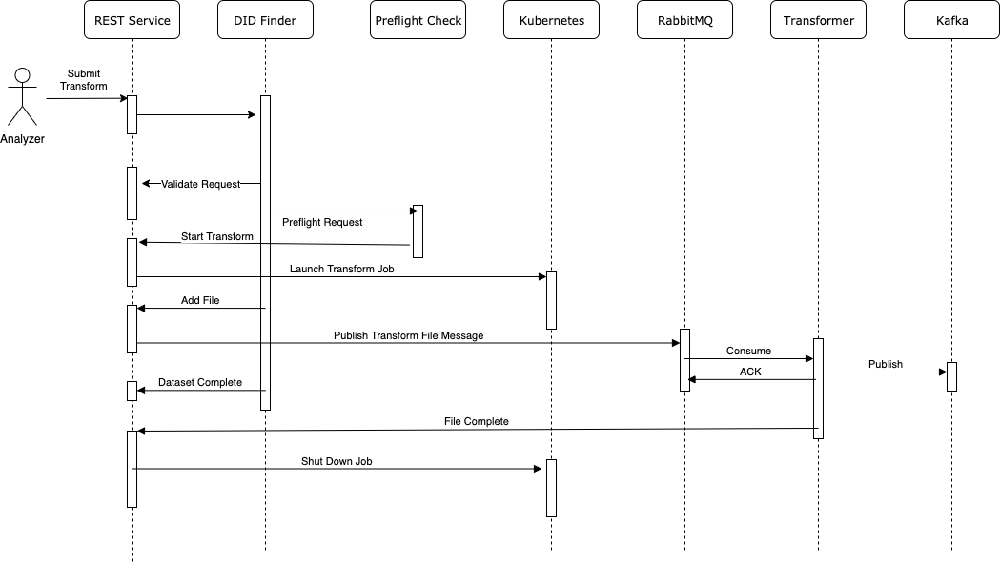

ServiceX REST Server
====================

.. image:: https://travis-ci.org/ssl-hep/ServiceX_transformer.svg?branch=pytest
    :target: https://travis-ci.org/ssl-hep/ServiceX_App
.. image:: https://codecov.io/gh/ssl-hep/ServiceX_App/branch/develop/graph/badge.svg
  :target: https://codecov.io/gh/ssl-hep/ServiceX_App
.. image:: https://img.shields.io/badge/License-BSD%203--Clause-blue.svg
   :target: https://opensource.org/licenses/BSD-3-Clause

This is a flask app for receiving user requests and orchestrating the ServiceX
services:

User Management
---------------
If ``ENABLE_AUTH`` is set to True, an identity management system will be
enabled. Users will need to create accounts in order to make requests.
The system consists of two components: authentication (verification of each
user's identity) and authorization (control of access to API resources).

Authentication
**************
Authentication is currently implemented via `Globus <https://www.globus.org/>`_,
a federated identity provider which implements the OAuth 2.0 protocol.
Prospective users must visit the ServiceX website included in this Flask app
at its hosted domain. There, they can sign in via Globus to confirm their
identity using any supported identity provider (e.g. their university, CILogon,
or GitHub account). A corresponding ServiceX user account will be created.
Existing users can also visit the website to view information associated with
their account.

Authorization
*************
If authentication is enabled, API resources will be protected with JWT bearer
tokens. Authenticated users will be issued a ServiceX API token, which is a JWT
refresh token containing their identity. This refresh token can be used to
obtain access tokens, which are required in order to access protected resources.

Clients accessing the ServiceX API, such as the
`Python client <https://github.com/ssl-hep/ServiceX_frontend>`_,
should accept the API token as a configuration value or environment variable,
and use it to obtain access tokens and make requests. Requests to secured
endpoints should have an HTTP header called ``Authorization`` with a value
of ``Bearer <access_token>``.

Administrators
**************
Admin accounts are used to manage other users. The API server supports a
``JWT_ADMIN`` config property, which should be set to the email address of the
initial admin user. The first user to sign up with this email address will be
made an admin user automatically. This should be done immediately after
deployment.

New users are marked as pending, and will be unable to submit requests until
approved. ServiceX admins can view the pending users with a GET on the
``/pending`` endpoint. They can approve a pending user with a POST to
``/accept`` with a body of:

.. code:: json

    {
        "email": "<the email>"
    }

The API can also be configured to send notifications of new user registrations
to a Slack channel of choice, allowing administrators to approve pending users
directly from Slack. This requires setting up a Slack app and supplying the
``SLACK_SIGNING_SECRET`` and ``SIGNUP_WEBHOOK_URL`` config values. For full
details, see the `ServiceX README <https://github.com/ssl-hep/ServiceX>`_.

Email notifications can be sent to users when they are approved via Mailgun.
All this requires is setting the ``MAILGUN_API_KEY`` and ``MAILGUN_DOMAIN``
config values.

Local Development
-----------------
First install the app and test dependencies with:

.. code:: bash

    pip install -e ".[test]"

The application depends on the psycopg2 library to access postgres. The
install for this library can be tricky on some desktop environments. You may have better luck with
the pre-built binary package. Edit ``setup.py`` and replace ``psycopg2``
with ``psycopg2-binary`` and try to pip install again.

Running Tests
*************
We use flake8 to verify coding standards. You can run this tool over your code
with the command

.. code:: bash

    flake8

We use pytest to verify the code. These tests can be run with the command

.. code:: bash

    python -m pytest

Detailed Transformer Logging
----------------------------
It can be complicated to debug issues inside the transformers on a very large
dataset. To make it easier, detailed log statements are sent back from the
transformers and stored in the postgres database. If you need to interrogate
this database you can forward the postgres port to your development system with

.. code:: bash

	kubectl port-forward xaod-postgresql-0 5432:5432

Then use your favorite postgres sql client to connect to this
database with the connection URL``jdbc:postgresql://localhost:5432/postgres``
with the user postgres and the password leftfoot1.

Of particular interest is the ``file_status`` table. It contains entries for
each transformed root file when it starts and when it finishes, retries, or
reports an error.

You can find errors with

.. code:: sql

    select * from file_status where request_id='da3d7cc2-7f97-4c98-be77-4e9c22f67425' and status='failure';

These records include the error and the first 2048 characters of the stack
trace along with the pod name where the transformer ran (you might be able to
catch the full log with the ``kubectl logs -p`` which can retreive logs from
terminated pods)

More information on the specific file can be found by joining with the ``files``
table.

Database Migration
------------------
We use the alembic tooling under ``Flask-Migrate`` library to manage migration of
database as schema evolves.

Alembic stores database versions in the ``migrations`` directory. These are
applied to the database as part of ``boot.sh``

Create a new version of the database after updating ``models.py`` with the
command:

.. code:: bash

	FLASK_APP=servicex/app.py APP_CONFIG_FILE=../app.conf flask db migrate -m "<<release version>>"

This will add a new script under ``migrations`` directory. Check it for
accuracy and check it into the repo to have it applied when the built docker
image is next run against a database.

Building Docker Image
---------------------

.. code:: bash

   docker build -t servicex_app .

Running Docker
--------------

.. code:: bash

   docker run --name servicex-app --rm -p8000:5000 \
    --mount type=bind,source="$(pwd)"/sqlite,target=/sqlite \
    -e APP_CONFIG_FILE=/home/servicex/docker-dev.conf \
    servicex_app:latest

Cleaning up old Transformation Queues
-------------------------------------

It's easy to accumulate a bunch of transformation queues during testing.
It would be quite tedious to try to delete them via the management
console. You can install the rabbitmqadmin cli and then with some tricky
scripting batch delete queues:

.. code:: bash

   ./d.sh $(python  rabbitmqadmin -V / --port=30182 -u user -p leftfoot1 list queues | grep ".*-.*" | awk '{print $2}')
