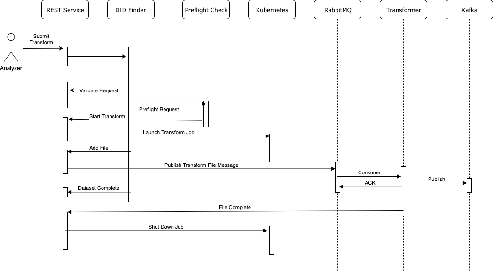

ServiceX REST Server
====================

.. image:: https://travis-ci.org/ssl-hep/ServiceX_transformer.svg?branch=pytest
    :target: https://travis-ci.org/ssl-hep/ServiceX_App
.. image:: https://codecov.io/gh/BenGalewsky/ServiceX_App/branch/pytest/graph/badge.svg
  :target: https://codecov.io/gh/BenGalewsky/ServiceX_App
.. image:: https://img.shields.io/badge/License-BSD%203--Clause-blue.svg
   :target: https://opensource.org/licenses/BSD-3-Clause

This is a flask app for receiving user requests and orchestrating the ServiceX
services:

User Management
---------------
If ``ENABLE_AUTH``  is set to True endpoints will be protected with JWT bearer
tokens.

An initial admin account is created when the app is started. That account's
username is found in the ``JWT_ACCOUNT`` config property, and the password is
set from ``JWT_PASSWORD``. This account can be used for all interactions with
the endpoints, and can also be used to enable new users who submit requests for
access to the system.

Users (including the admin user) obtain a bearer token with the ``/login``
endpoint. This POST request expects a JSON body that looks like:

.. code:: json

    {
        "username": "admin",
        "password": "password"
    }

The response will include an ``access_token`` and a ``refresh_token``. Requests
to secured endpoints should have an HTTP header called ``Authorization`` it must
have as the value ``Bearer`` and the token returned by the login POST.

New users may request an account via the web page hosted at ``/``. This form
asks for the username and password they wish to use. New accounts are marked
as pending. An admin user can view the pending accounts with a GET on the
``/pending`` endpoint. They can approve the request with a POST to ``/accept``
with a body of:

.. code:: json

    {
        "username": "<the username>"
    }

The API can also be configured to send notifications of new user registrations
to a Slack channel of choice and allow administrators to approve pending users
directly from Slack. This requires setting up a Slack app and supplying the
``SLACK_SIGNING_SECRET`` and ``SIGNUP_WEBHOOK_URL`` config properties. For full
details, see the `ServiceX README <https://github.com/ssl-hep/ServiceX>`_.

Local Development
-----------------
First install the app and test dependencies with:

.. code:: bash

    pip install -e ".[test]"

The application depends on the psycopg2 library to access postgres. The
install for this library can be tricky on some desktop environments. You may have better luck with
the pre-built binary package. Edit ``setup.py`` and replace ``psycopg2``
with ``psycopg2-binary`` and try to pip install again.

Running Tests
*************
We use flake8 to verify coding standards. You can run this tool over your code
with the command

.. code:: bash

    flake8

We use pytest to verify the code. These tests can be run with the command

.. code:: bash

    python -m pytest

Detailed Transformer Logging
----------------------------
It can be complicated to debug issues inside the transformers on a very large
dataset. To make it easier, detailed log statements are sent back from the
transformers and stored in the postgres database. If you need to interrogate
this database you can forward the postgres port to your development system with

.. code:: bash

kubectl port-forward xaod-postgresql-0 5432:5432

Then use your favorite postgres sql client to connect to this
database with the connection URL``jdbc:postgresql://localhost:5432/postgres``
with the user postgres and the password leftfoot1.

Of particular insterest is the ``file_status`` table. It contains entries for
each transformed root file when it starts and when it finishes, retries, or
reports an error.

You can find errors with

.. code:: sql

    select * from file_status where request_id='da3d7cc2-7f97-4c98-be77-4e9c22f67425' and status='failure';

These records include the error and the first 2048 characters of the stack
trace along with the pod name where the transformer ran (you might be able to
catch the full log with the ``kubectl logs -p`` which can retreive logs from
terminated pods)

More information on the specific file can be found by joining with the ``files``
table.

Building Docker Image
---------------------

.. code:: bash

   docker build -t servicex_app .

Running Docker
--------------

.. code:: bash

   docker run --name servicex-app --rm -p8000:5000 \
    --mount type=bind,source="$(pwd)"/sqlite,target=/sqlite \
    -e APP_CONFIG_FILE=/home/servicex/docker-dev.conf \
    servicex_app:latest

Cleaning up old Transformation Queues
-------------------------------------

It's easy to accumulate a bunch of transformation queues during testing.
It would be quite tedious to try to delete them via the management
console. You can install the rabbitmqadmin cli and then with some tricky
scripting batch delete queues:

.. code:: bash

   ./d.sh $(python  rabbitmqadmin -V / --port=30182 -u user -p leftfoot1 list queues | grep ".*-.*" | awk '{print $2}')